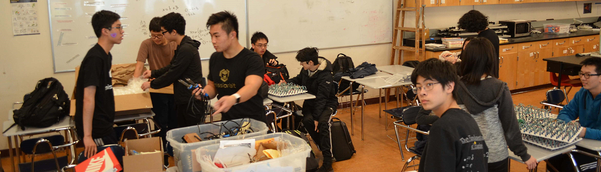

Lowell Electrical Engineering & Computer Science (EECS) Club is a student-run club at Lowell High School in San Francisco, California. Our goal is to inspire students' interest in EECS by providng them exposure to the field.

We teach our members how to solder, code, build circuits, and use Arduino microcontrollers through hands-on projects creating colorful RGB displays, animated LED cubes, four-legged robots, and much more. In addition, we have guest speakers from the industry talk about the field and their work. All students are welcome to join regardless of experience. Our workshops will enable our members to create super cool projects in no time.

We meet every Friday from 3:30 to 4:30 pm. Due to the pandemic, our meetings are hosted on Zoom. Sign up [here](https://forms.gle/P8FQZdq8b5aLnoRQ9) (must use SFUSD account).

We hope to see you there!